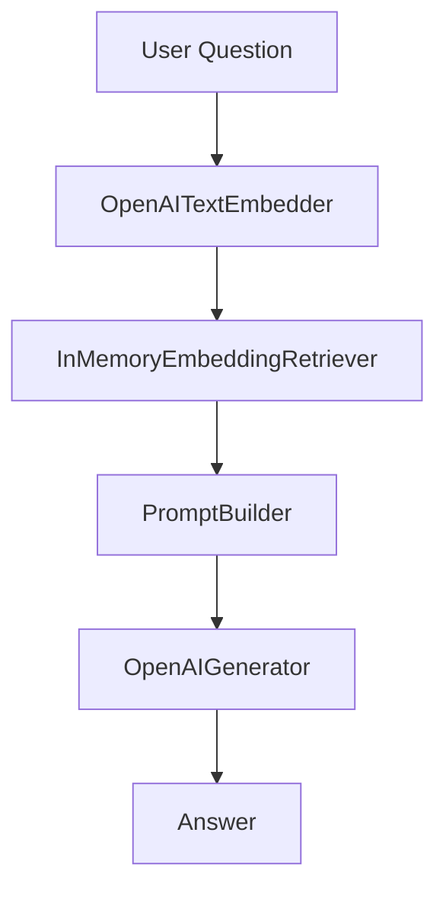

# RAG Pipeline with Haystack 2.0

A Retrieval-Augmented Generation (RAG) pipeline implementation using Haystack 2.0 that demonstrates document processing and question answering capabilities.

Based on blog post: [Haystack: the new LLM framework that is shaking its competitors](https://medium.com/ai-in-plain-english/haystack-the-new-llm-framework-that-is-shaking-its-competitors-1a083a153fd9).

## Features
- HTML document ingestion and processing
- Document cleaning and sentence splitting
- OpenAI text embeddings for semantic search
- GPT-3.5-turbo for answer generation
- In-memory document store with embedding retrieval

## Architecture



## Getting Started

### Prerequisites
- Python 3.8+
- OpenAI API key

### Installation
1. Clone the repository
```bash
git clone https://github.com/schmitech/haystack-ai-demo.git
cd haystack-ai-demo
```

2. Create and activate virtual environment
```bash
python -m venv venv
source venv/bin/activate  # Linux/MacOS
venv\Scripts\activate.bat  # Windows
```

3. Install dependencies
```bash
pip install -r requirements.txt
```

4. Create .env file with your OpenAI API key (copy from .env.example)
```env
OPENAI_API_KEY=your-api-key-here
```

### Usage
Run the pipeline:
```bash
python rag_pipeline.py
```

Example questions answered:
1. What is the profession of Richard M. Stallman and where does he work?
2. Why did Stallman get frustrated when he tried to retrieve his print job from the new Xerox printer?

## Configuration
Key components:
- Document splitting: 5 sentences per chunk
- OpenAI model: gpt-3.5-turbo
- Embedding model: text-embedding-ada-002 (default)

## Dependencies
- `haystack-ai`: Pipeline and components
- `openai`: GPT-3.5-turbo and embeddings
- `unstructured`: HTML processing
- `nltk`: Sentence tokenization

## Troubleshooting
If you see NLTK warnings about sentence splitting:
```python
# Add this before running the pipeline
import nltk
nltk.download('punkt')
```

## References
- [Haystack 2.0 Documentation](https://docs.haystack.deepset.ai/docs/intro)
- [OpenAI API Documentation](https://platform.openai.com/docs/api-reference)

